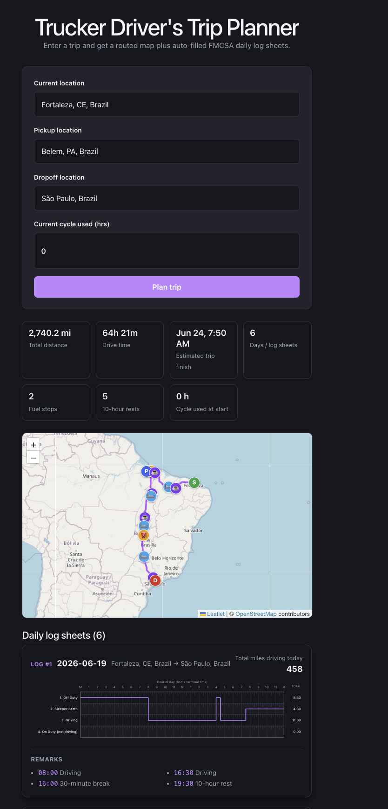

# Trucker Driver's Trip Planner

A full-stack trip planning app for truck drivers. It takes a current location,
pickup location, dropoff location, and current cycle hours used, then produces:

- a routed map with pickup, dropoff, fuel, break, rest, and restart markers
- trip summary metrics, including estimated trip finish
- daily log sheets generated from Hours of Service rules



[Video overview](https://www.loom.com/share/c1ed21aa097a4820807d7f61a2fb0bdb)

[Live app](https://trucker-drivers-management-jsmwkjdfd-yasmings-projects.vercel.app/)

## Rules Source

The Hours of Service behavior is based on the FMCSA driver guide included in
this repo:

```text
docs/drivers-guide.pdf
```

The guide assumptions are also reflected in the implementation:

- property-carrying driver
- 70 hours / 8 days cycle
- no adverse driving conditions
- fueling at least once every 1,000 miles
- 1 hour for pickup
- 1 hour for dropoff

## Architecture

The project is a single Django app serving a React frontend.

```text
React UI
  -> Django REST API
    -> geocoding service
    -> OpenRouteService routing service
    -> Hours of Service engine
    -> in-memory trip store
  -> JSON response
  -> React map, summary, and daily log sheets
```

### Backend

- `config/` contains Django settings, URLs, and ASGI/WSGI entrypoints.
- `drivers/views.py` exposes the trip planning API.
- `drivers/serializers.py` validates trip input and formats trip output.
- `drivers/services/geocoding.py` calls OpenRouteService geocoding.
- `drivers/services/routing.py` calls OpenRouteService directions.
- `drivers/services/hours_of_service.py` applies the driving, rest, break,
  pickup, dropoff, fuel, and cycle rules.
- `drivers/services/trip_store.py` stores planned trips in memory.

The app does not require SQLite for normal use. Planned trips are kept in
process memory only, so restarting Django clears them.

### Frontend

The frontend is React 19 + TypeScript + Vite.

- `src/App.tsx` owns the planner state and renders the main flow.
- `src/components/TripForm.tsx` collects trip inputs.
- `src/components/LocationPicker.tsx` searches/selects addresses.
- `src/components/TripSummary.tsx` displays distance, drive time, finish time,
  rests, fuel stops, and cycle used.
- `src/components/RouteMap.tsx` renders the Leaflet route map.
- `src/components/LogSheet.tsx` draws the daily log sheet grid.

## Project Layout

```text
project-root/
├── config/              # Django settings, URLs, WSGI/ASGI
├── drivers/             # Trip planner API, services, and tests
├── docs/                # README images
├── src/                 # React app
├── static/              # Built React SPA assets served by Django
├── manage.py
├── requirements.txt
├── package.json
├── vite.config.ts
└── Makefile
```

## Prerequisites

- Python 3.14.4
- Node.js 20+ 22 or 24 recommended
- An OpenRouteService API key

Create a local `.env` file:

```bash
ORS_API_KEY=your_openrouteservice_api_key_here
DJANGO_DEBUG=True
```

`DJANGO_DEBUG` defaults to `False` (production-safe), so set it to `True` for
local development.

In production (`DJANGO_DEBUG=False`), you must also set a unique, secret
`DJANGO_SECRET_KEY`; the app refuses to start without it. Generate one with:

```bash
python -c "from django.core.management.utils import get_random_secret_key; print(get_random_secret_key())"
```

## Setup

```bash
python -m venv .venv
.venv/bin/python -m pip install -r requirements.txt
npm install
```

## Make Commands

Start Django and Vite together:

```bash
make up
```

```bash
make down
```

Run the backend test suite:

```bash
make tests
```
